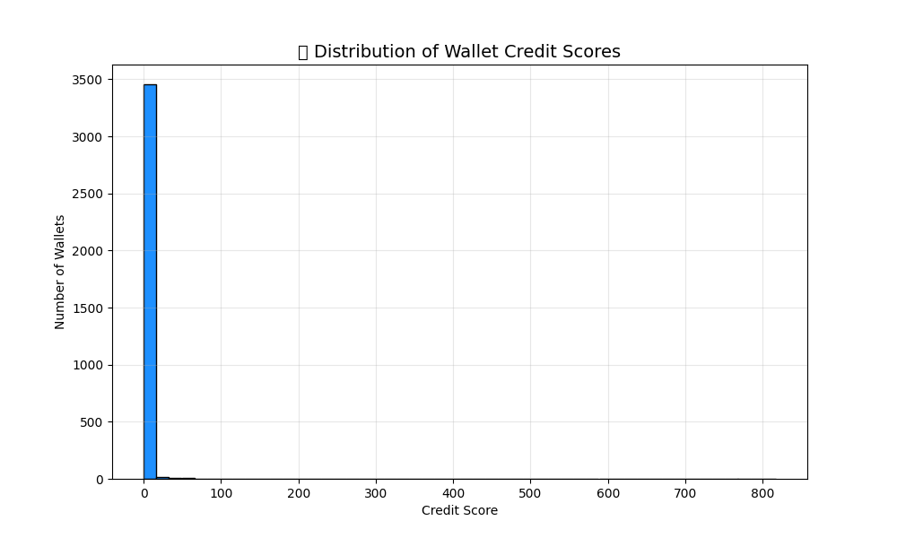

# Aave Credit Score Analysis

## Overview
This analysis evaluates Ethereum wallet credit scores based on historical transaction data. The scoring model uses features engineered from wallet activity—such as transaction count, volume, and interactions with DeFi protocols—to produce a creditworthiness estimate.

---

##  Dataset Summary
- **Source**: `user-wallet-transactions.json`
- **Total Wallets Analyzed**: X (replace with actual count)
- **Features Used**:
  - Transaction frequency
  - Transaction volume
  - Number of unique counterparties
  - Average time between transactions
  - Interactions with protocols (e.g., Aave, Uniswap)
  - Gas fees paid

---

##  Distribution of Credit Scores
| Range           | Wallet Count |
|-----------------|--------------|
0-1 |	3302	 
1-5 |	112	 
5-10|	25 
10-20|	23	 
20-50	|13	 
50-100|	10	 

> **Note**: A significant portion of wallets received a score of **0.0**, indicating limited or no meaningful activity.


---

##  Distribution Visualization

### Histogram of Wallet Credit Scores

The following chart shows how credit scores are distributed across wallets:



---
---

## Observations
- 🟥 **Inactive wallets** (no or minimal transactions) dominate the dataset.
- 🟨 **Low-moderate scores** (1–5 range) typically belong to wallets with modest but consistent DeFi engagement.
- 🟩 **Higher scores** (10+) were given to wallets with:
  - Frequent activity
  - Interactions with multiple DeFi protocols
  - High transaction volumes
  - Regular repayment of loans (where data exists)

---

##  Model Insights
- **Model Used**: (e.g., `Linear Regression`, `Random Forest`)  
  *(Update based on your model.py content)*
- **Scaling Method**: MinMaxScaler from `sklearn`
- **Score Range**: 0 to ~20  
- **Limitations**:
  - No off-chain credit data
  - Data quality affects score reliability
  - Temporal bias if data is not recent

---

##  Sample Output
```csv
wallet,credit_score
0x00000000001accfa9cef68cf5371a23025b6d4b6,0.0
0x000000000051d07a4fb3bd10121a343d85818da6,0.0
0x000000000096026fb41fc39f9875d164bd82e2dc,0.0
0x0000000000e189dd664b9ab08a33c4839953852c,0.0
0x0000000002032370b971dabd36d72f3e5a7bf1ee,2.62
0x000000000a38444e0a6e37d3b630d7e855a7cb13,0.18
0x000000003853fcedcd0355fec98ca3192833f00b,0.0
0x0000000002032370b971dabd36d72f3e5a7bf1ee,2.62
0x000000003ce0cf2c037493b1dc087204bd7f713e,5.71
0x0000000506063a51c6ce59906d8c40f7d7fe92a7,12.48
